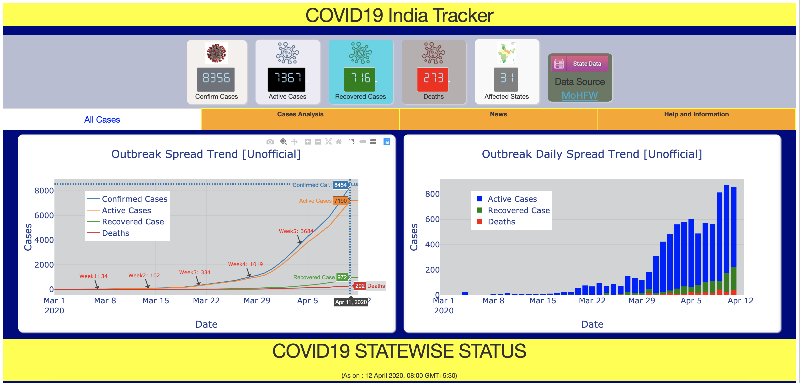
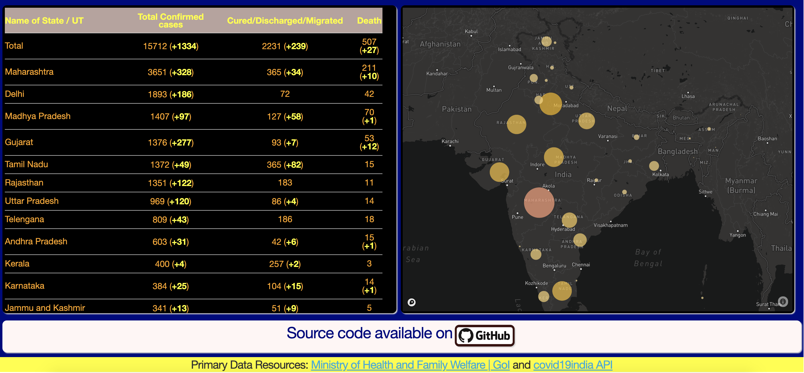

# [**COVID19-India-Tracker**](https://covid19-india-tracker.herokuapp.com/)
***





# Usages

```bash
$ git clone https://github.com/dc-aichara/COVID19-India-Tracker.git # clone repository
$ cd COVID19-India-Tracker # Change directory
$ conda env create -f environment.yml  # create conda environment from `environment.yml`. Recommended. 
$ conda activate aichara
OR
$ pip install -r requirements.txt # Install dependencies in a python environment. 
```

## Get mapbox api key from mapbox api and create a `settings.ini` file.

```text
[settings]
MAPBOX_SECRET=YOUR_MAPBOX_KEY
MAPBOX_STYLE=mapbox://styles/mapbox/dark-v9
```
## Edit `data.py` to use save and load data from local directory instead of `Mongodb` Or setup MongoDB account and credentials to `settings.ini`.

```text
[settings]
MAPBOX_SECRET=YOUR_MAPBOX_KEY
MAPBOX_STYLE=mapbox://styles/mapbox/dark-v9
MGDB_pass=Your_MongoDB_Password
MGDB_user=Your_MongoDB_Username
```
## Run App
```bash
$ python index.py
```
visit http://127.0.0.1:8050/ to view dashboard.

# How to create Dashboard with Plotly's Dash
Read my articles on medium:
- [Building Dashboard Part-1](https://medium.com/analytics-vidhya/building-a-dashboard-app-using-plotlys-dash-a-complete-guide-from-beginner-to-pro-61e890bdc423)
- [Building Dashboard Part-2](https://medium.com/analytics-vidhya/building-a-dashboard-app-using-plotlys-dash-a-complete-guide-from-beginner-to-pro-e7657a4eb707)
- [Building Dashboard Part-3](https://medium.com/game-of-data/building-a-dashboard-app-using-plotlys-dash-favicon-google-analytics-custom-css-75f7a1e95a88)

# Contribute
- Clone this repo
- Create a new branch
- Make changes
- Submit a PR
