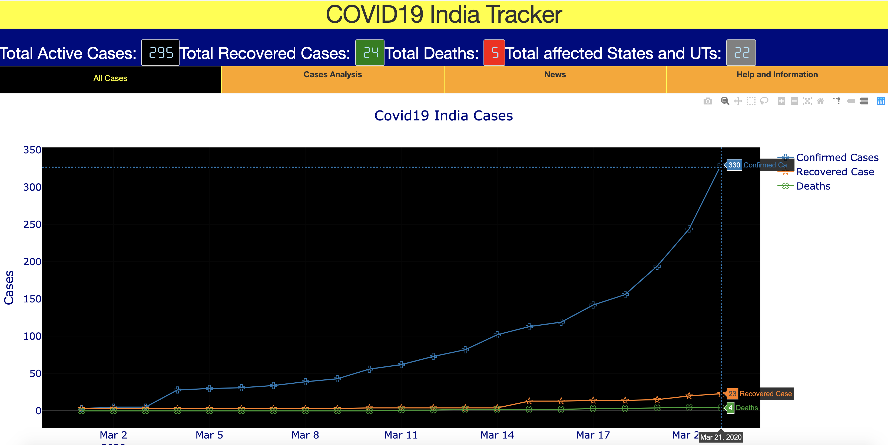

# [COVID19-India-Tracker](https://covid19-india-tracker.herokuapp.com/)



# Usages

```text
$  git clone https://github.com/dc-aichara/COVID19-India-Tracker.git # clone repository
$ cd COVID19-India-Tracker # Change directory
$ pip install -r requirements.txt # Install dependencies
$ python index.py  # Run app
# visit http://127.0.0.1:8050/
```
