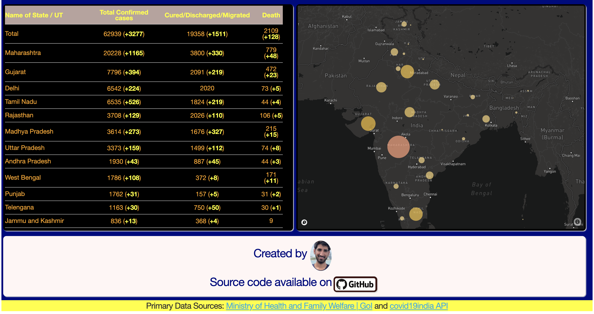

# [**COVID19-India-Tracker**](https://covid19-india-tracker.herokuapp.com/)
***




# Usages

```bash
$ git clone https://github.com/dc-aichara/COVID19-India-Tracker.git # clone repository
$ cd COVID19-India-Tracker # Change directory
$ pip install -r requirements.txt # Install dependencies
$ python index.py  # Run app
# visit http://127.0.0.1:8050/
```
# How to create Dashboard with Plotly's Dash
Read my articles on medium:
- [Building Dashboard Part-1](https://medium.com/analytics-vidhya/building-a-dashboard-app-using-plotlys-dash-a-complete-guide-from-beginner-to-pro-61e890bdc423)
- [Building Dashboard Part-2](https://medium.com/analytics-vidhya/building-a-dashboard-app-using-plotlys-dash-a-complete-guide-from-beginner-to-pro-e7657a4eb707)

# Contribute
- Clone this repo
- Create a new branch
- Make changes
- Submit PR
